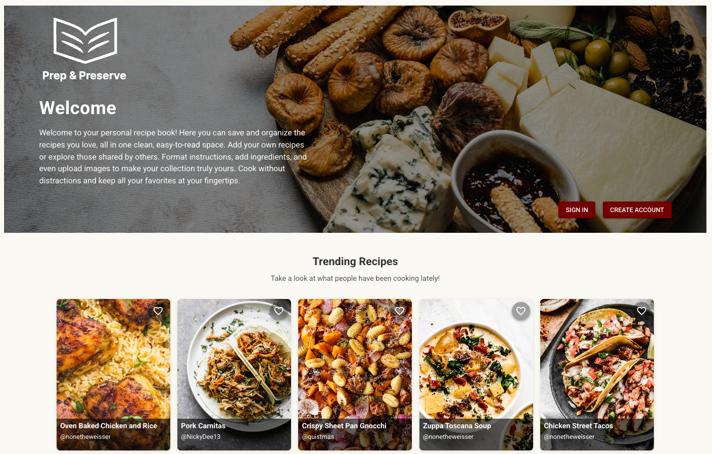
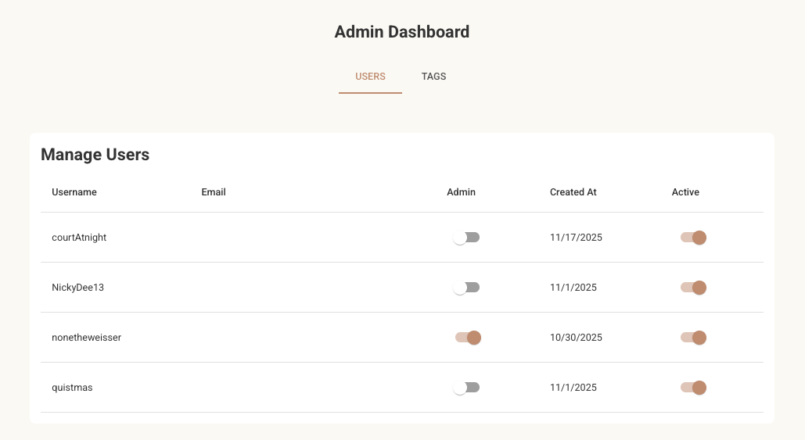

# Prep and Preserve

Duration: 2 Week Sprint

**Description**

Prep and Preserve is an app that lets you save all your favorite recipes in one consistent, organized place. You can format recipes, make edits, and even share them with the rest of the Prep & Preserve community. You can also explore community recipes, favorite the ones you want to try, and they’ll be saved right on your own page.

The problem it solves: recipes are scattered across social media, emails, family notes, and bookmarks. Prep and Preserve centralizes them, making it easy to save, edit, and share.

To see the fully functional site, please visit: [DEPLOYED VERSION OF APP]

---

## Screen Shot






---

## Prerequisites

- [Node.js](https://nodejs.org/en/)
- [PostgreSQL](https://www.postgresql.org/)
- A Cloudinary account (for image uploads)
- Optional: Postico (for running SQL queries)
- Recommended: VS Code or any other code editor

---

## Installation

1. Clone this repository.
2. Run `npm install` in both the `client` and `server` directories.
3. Create a PostgreSQL database named `prep_and_preserve`.
4. Run the queries in `tables.sql` to create all necessary tables and populate initial data.
5. Add any necessary environment variables in a `.env` file:

```
- `DATABASE_URL` - PostgreSQL connection string
- `VITE_CLOUDINARY_NAME` & `VITE_CLOUDINARY_UPLOAD_PRESET` - for uploading images in recipes and profiles
```

6. npm run server / npm run client

---

## Usage

- Explore trending recipes or browse the community page without an account.
- Create an account to unlock full features: add, edit, and save your recipes.
- Add a new recipe with ingredients, instructions, tags, and optionally upload an image.
- Browse community recipes, favorite what you like, and see them on your personal recipe page.
- Filter recipes by tags or search terms to quickly find what you want.
- Deactivate your account safely; your recipes will no longer be visible until you reactivate.
- Update your profile picture or change your password from the profile settings page.

---

## Stretch Goals

- Add a "Most Made" list to complement the trending recipes page.
- Implement user profile pages:
  - Follow other users and receive notifications.
- Dark / Light mode toggle for the UI.
- AI/LLM functionality:
  - Upload recipe cards or scanned files and have AI generate the recipe within the app.
  - Track nutrition information for recipes.

---

## Built With

1. Frontend: React, Material UI
2. State Management: Zustand
3. Backend: Node.js, Express
4. Database: PostgreSQL
5. File Uploads: Cloudinary
6. Rich Text Editor: ReactQuill
7. Others: Axios for API requests

---

## License

MIT

---

## Acknowledgement

Thanks to Prime Digital Academy for providing guidance and support throughout this project.

---

## Support

If you have suggestions or issues, please email me at nicholas.weisser@gmail.com
